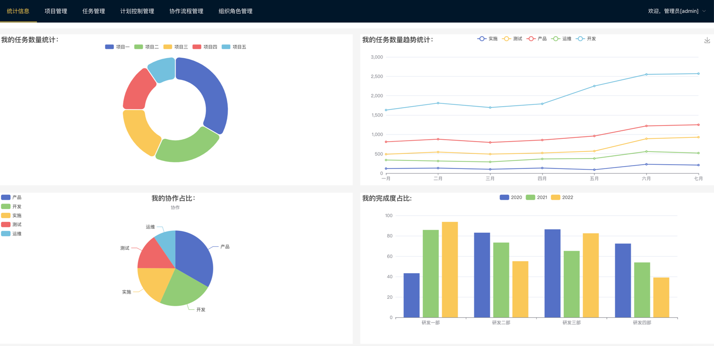
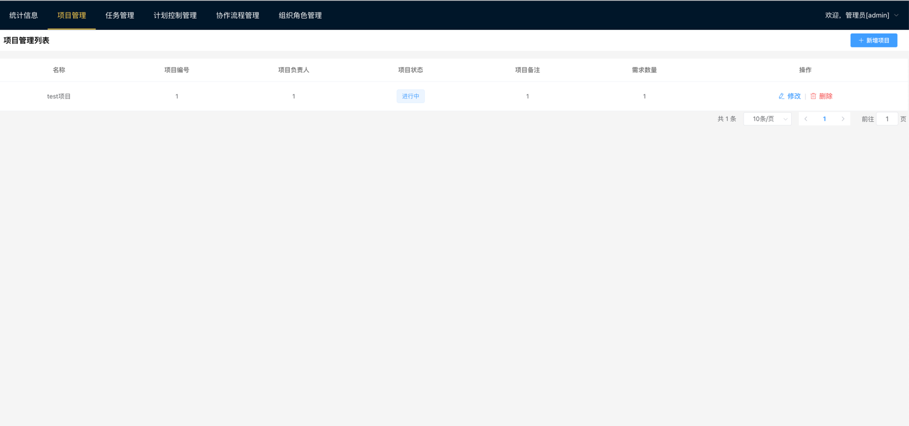
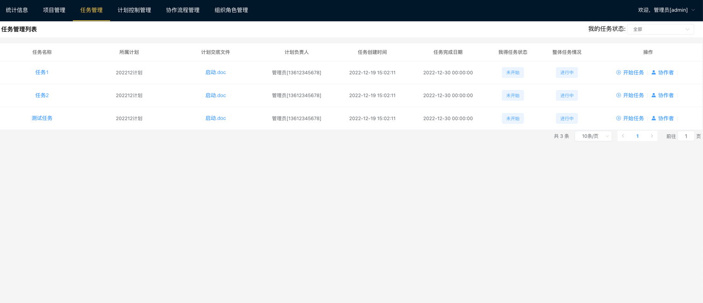
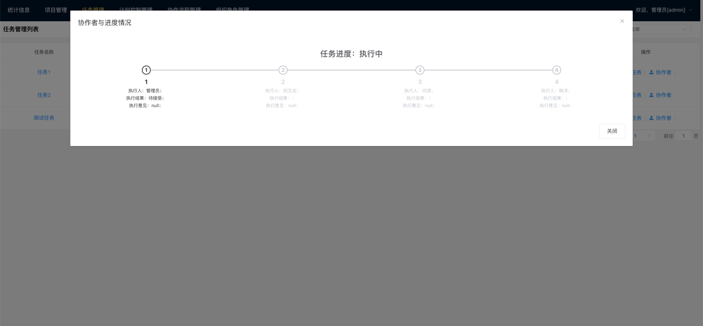
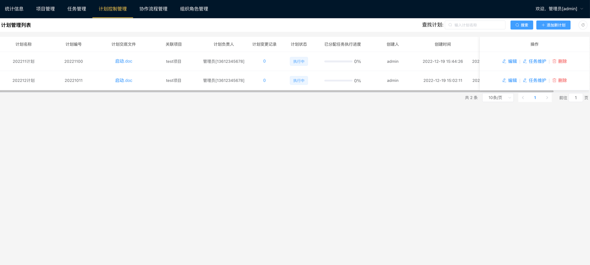
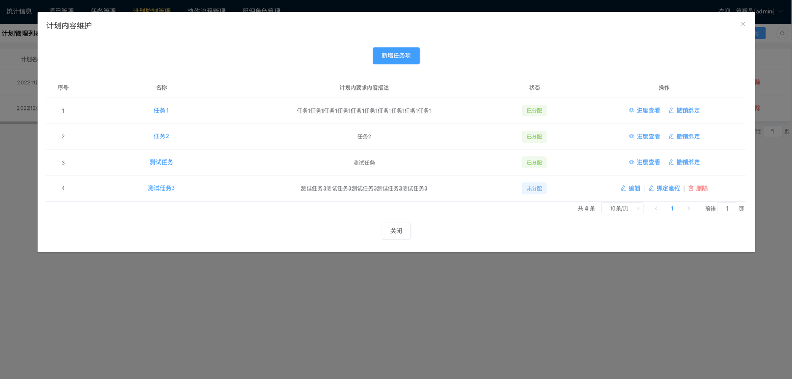
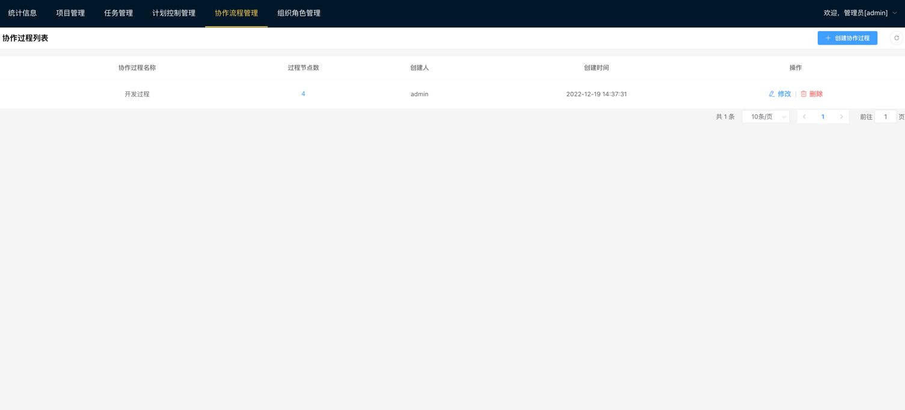
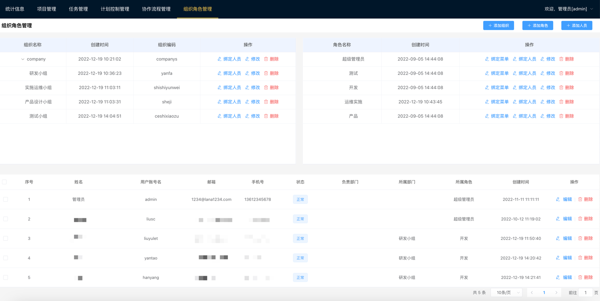
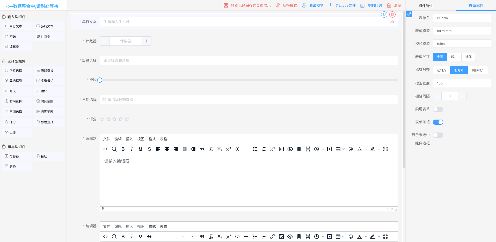
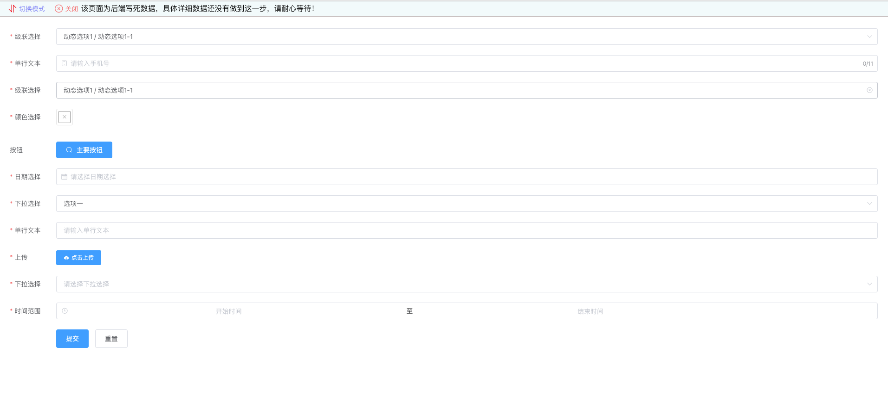

# lana-boot
努努力，搞一个自定义审批内容的OA
技术栈主要使用：jdk8+springboot2.6+mysql+minio+maven3.5+knife4j

欢迎点个Stars支持一下哦
# 现应用场景：
目前用于研发团队中的进度安排，创建计划--创建任务，并绑定执行流程，用来需求、研发、测试、实施、运维人员的任务安排、执行结果留存、执行计划把控。

# 后续计划1：
修改完善并结合表单设计器（先阶段表单设计器在：个人中心--表单设计菜单下。具体使用正在搞...），整合微信通知、邮箱通知、有必要的话就整合短信通知。让任务能够简单及时分配，以及快速通知。


## 项目设置与使用
```
环境要求：
jdk8
maven5.3+

mysql8.0
minio，并且创建data桶，以及设置好权限


运行配置：

1、下载代码：https://github.com/liuyulet/lana
2、导入编辑器（idea）
3、构建项目（刷新maven等）
4、修改配置文件（数据库、minio、等配置，具体修改位置查看application.yml、application-dev.yml文件）
5、推荐安装easycode、lombok、mybatisx、mybatisx long free等插件
6、运行项目


```


# 1.0 基础特性
1. 项目管理;
2. 任务管理;
3. 计划控制管理;
4. 协作流程管理;
5. 组织角色管理;


# 截图


















